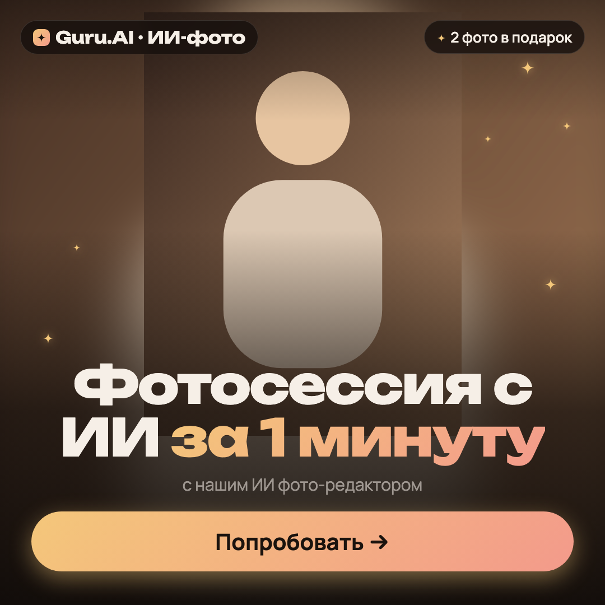

# Первый креатив

Здесь можно начать без ключа Kie.ai и без навыков программирования. Агент выполнит команды; вам нужно только дать фото и указать текст.

## 1. Попробуйте готовый пример без своего фото

Скопируйте агенту этот запрос:

> Установи https://github.com/easylaneof/guru-skills по INSTALL.md. Затем проведи меня по FIRST_RUN.md: сначала собери и покажи готовый демо-пример в трёх форматах без Kie.ai. После этого помоги сделать креатив из моего фото. Не запускай нейрогенерацию.

После установки агент покажет три PNG. Вот как выглядит квадратный пример:

Это проверка наложения текста: вместо фотографии используется геометрическая фигура. Никакого ключа и платной генерации не требуется. [Горизонтальный пример](examples/previews/minuta-16x9.png) и [вертикальный пример](examples/previews/minuta-9x16.png) тоже включены.

**Первый шаг готов, когда вы видите три изображения**, а агент сообщил, где они сохранены. Если что-то не установилось, агент должен помочь исправить ошибку, прежде чем идти дальше.

## 2. Сделайте креатив из своего фото

Прикрепите готовую фотографию PNG/JPG/WebP к чату агента и напишите:

> Используй guru-photo-creatives. Возьми приложенное фото без нейрогенерации. Наложи текст пресета minuta и сделай 1:1, 16:9 и 9:16. Покажи результат и дай пути к PNG.

Пресет `minuta` — уже включённый пример текста Guru.AI:

- Заголовок: «Фотосессия с ИИ».
- Акцент: «за 1 минуту».
- Подзаголовок: «с нашим ИИ фото-редактором».
- Верхняя плашка: «2 фото в подарок».
- Кнопка на изображении: «Попробовать →».
- Бренд: «Guru.AI · ИИ-фото».

Это исторический рекламный текст: перед использованием в рекламе проверьте, что предложение актуально. Для своего текста просто перечислите замены в запросе. Агент не должен придумывать акцию за вас.

Если агент не может прочитать вложение, сохраните фото в папку `input/` внутри установленного репозитория, например `input/my-photo.jpg`, и укажите этот путь. Можно передать прямую ссылку на изображение вместо файла.

Агент сам подготовит брифы и сохранит креативы в `output/`. Редактировать JSON вручную не нужно. Готовое фото при этом не отправляется в Kie.ai: текст накладывается локально.

## 3. Попробуйте одну правку

После просмотра квадрата отправьте:

> В последнем квадратном креативе уменьши заголовок и подзаголовок до 80%. Фото, сам текст и остальные форматы оставь прежними. Покажи обновлённый PNG. Без нейрогенерации.

Агент изменит `copy.text_scale` в брифе квадратного креатива и перерендерит его. Повторный рендер того же брифа заменяет соответствующий PNG. Другие форматы сохранятся.

После этого вы умеете проходить весь цикл: фото → текст → три формата → правка. Можно продолжать обычными сообщениями в том же чате.

## Если нужно изменить само фото

Это отдельный сценарий с ключом Kie.ai и балансом. Например:

> Используй guru-photo-creatives. Сделай из приложенного фото один вариант: тот же человек с букетом роз, мягкий дневной свет, сохранить внешность. Затем наложи пресет minuta и сделай три формата. Если ключ Kie.ai не настроен, сначала помоги настроить его локально.

Один сгенерированный исходник используется для всех трёх форматов. Ключ вводится в локальный `.env`, а не отправляется в чат. Если ключа нет, можно продолжать работать с готовыми фото по шагам выше.

## Что сказать агенту, если что-то не получилось

| Ситуация | Сообщение агенту |
|---|---|
| Просит ключ, хотя фото уже готово | «Нужен только текст поверх готового фото. Используй локальный рендер без Kie.ai». |
| Не видит приложенное фото | «Фото сохранено в input/my-photo.jpg. Используй этот файл». |
| Лицо обрезалось | «Поправь кадрирование этого креатива, чтобы лицо было целиком видно. Фото не перегенерируй». |
| Не знаете, где результат | «Покажи готовые PNG и открой папку с ними, если можешь». |
| Скилл не появился в списке | «Прочитай .agents/skills/guru-photo-creatives/SKILL.md в папке репозитория и работай по нему». |

## Инструкция агенту: как провести первый запуск

Этот раздел применяется, когда пользователь попросил онбординг, первый пример или помощь с началом работы.

1. Если установка ещё не выполнена, следуй INSTALL.md. Если выполнена, используй существующее окружение, не переустанавливай его без причины.
2. Собери три `examples/poster-*.json` через `helpers/render.mjs`, если готовых результатов ещё нет. Покажи локальные PNG из `output/prochee/example/`, а не только сообщение об успешном выполнении команды. В репозитории также есть сохранённые превью в `examples/previews/`; не выдавай их за новый рендер при ошибке установки.
3. Коротко объясни разницу: наложение текста работает без ключа, изменение фото через нейросеть требует Kie.ai. Не запрашивай ключ для демо и локального наложения текста.
4. Для перехода к своему креативу предложи прикрепить фото или назвать путь. Если фото и текст уже даны, сразу используй их. Если пользователь попросил только демо, закончи на демо.
5. По получении исходника выполни запрос пользователя через основной скилл. Не запускай генерацию, пока пользователь не попросил изменить фото. Не подменяй согласованный текст пресетом из учебного примера.
6. Покажи результат и объясни, что правки можно описывать словами. Пример из шага 3 предложи как упражнение; не выполняй его автоматически без запроса.
